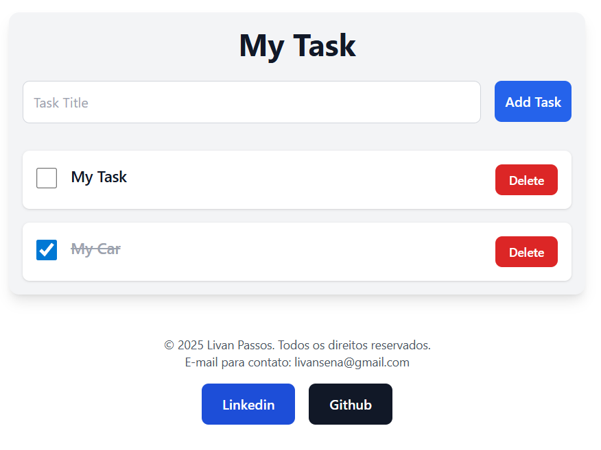

# ✅ Task Manager

Task management application developed with Ruby on Rails.

This project allows users to create, organize and manage tasks through a clean and responsive interface.

---

## 🌐 Live Website

https://livanpassos.com

---

## 🛠️ Technologies Used

- Ruby on Rails
- HTML5
- CSS3
- JavaScript
- PostgreSQL
- Docker
- Linux

---

## ✨ Features

- Create tasks
- Edit tasks
- Delete tasks
- Responsive design
- Clean interface
- Backend structure with Rails

---

## 📸 Preview



---

## 🚀 Running Locally

```bash
git clone https://github.com/livansena/Task-Manager.git

cd Task-Manager

bundle install

rails server
```

---

## 🧑‍💻 Author

Livan Passos

- LinkedIn: https://linkedin.com/in/livanpassos
- Portfolio: https://livanpassos.com
